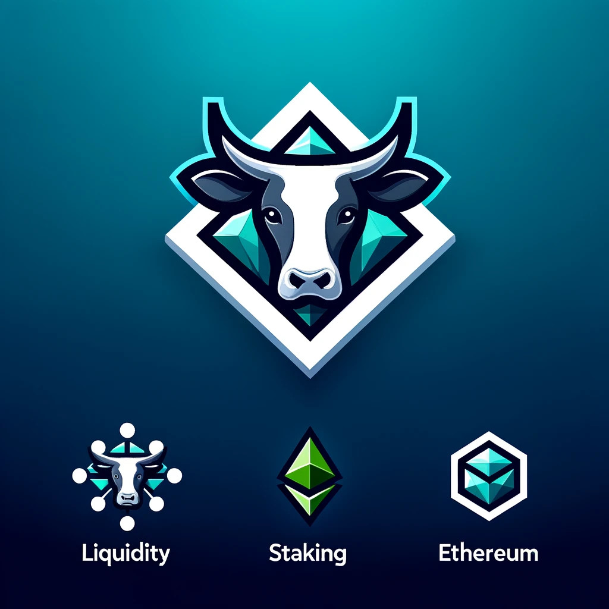

## What is Moo?

Moo is an **innovative** Liquid Staking Derivative protocol, with ever-green **mETHane** (_METH_) token, allowing you to invest **risk free** your Ether that would otherwise lay idle in you account. Tell your parents, grandpas and the neighbour you hate about it, they won't regret it!

### How is Moo different than other LSDs?
✨works magically

🧑‍🎨 created by team of top-notch artistic software engineers

🔁 self contained - everything, from native token, to beacon withdrawal address (yes, beacon withdrawals address is Moo) is contained in single easy-to-understand contract

⚙️ reliable - our offchain agents make sure that the protocol runs smoothly

🐄 calcium included


## User Flow
The flow below ensures that users can deposit funds, earn rewards, signal their intent to withdraw to enhance security, and finally, withdraw or harvest their rewards, considering the liquidity state of the contract.

1. Deposit Funds (breed):
    Users start by depositing ETH into the contract through the **breed(uint _amount)** function. This process mints an equivalent amount of a  mETHane token, effectively staking ETH to participate in the ecosystem and earn rewards over time.

2. Beacon Chain Balance Reporting (Not directly interacted by users):
There is privileged offchain oracle that checks beacon chain balance once a day and reports it to smart contract to get "accurate" funds held by the protocol, required for shares calculations

 3. Signal Intention to Withdraw (signalMilk):
        Once users decide to withdraw their earnings, they must first signal their intention through the **signalMilk()** function. This mechanism is designed to protect against just-in-time liquidity attacks, ensuring the integrity of reward distributions and the security of the funds.

4. Withdraw Rewards (milk):
        After the necessary time has passed since signaling the intent to withdraw, users can withdraw their rewards through the **milk(uint _amount, bool _exchangeToWETH)** function. This step involves withdrawing the earned rewards based on the user's staked amount. If the contract has sufficient liquidity (rewards available), the user receives their due ETH directly.

 5.  Handle Insufficient Contract Rewards (Implicit in milk):
        If there are not enough rewards in the contract at the time of milking, the withdrawal is not immediately processed. Instead, the user's due rewards are recorded, setting up the user to withdraw these pending rewards later. This is handled within the milk function, which records any insufficient funds as pending withdrawals.

 6.   Harvest Pending Rewards (harvest):
        Users can later harvest any pending rewards through the **harvest(address _recipient, uint _amount, bool _exchangeToWETH)** function. This allows users to collect their earned rewards once the contract has sufficient liquidity.

## Usage

### Build

```shell
$ forge build
```

### Test

```shell
$ forge test
```

### Format

```shell
$ forge fmt
```

### Gas Snapshots

```shell
$ forge snapshot
```

### Anvil

```shell
$ anvil
```

### Help

```shell
$ forge --help
$ anvil --help
$ cast --help
```
